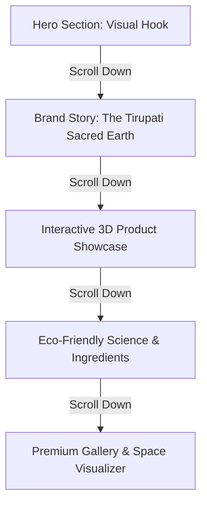

# DESIGN.md - Premium Scrollytelling Homepage Design
## Paint Manufacturing Company – Tirupati Edition (Aira Paints)

---

## 1. Brand Positioning & Identity
* **Brand Name:** Aira Paints
* **Tagline:** *Transforming Spaces. Inspiring Lives.*
* **Secondary Tagline:** *Premium Eco-Friendly Paints Crafted For Modern Indian Homes.*
* **Location Identity:** Tirupati Edition — emphasizing natural, heritage-inspired earthy tones, local eco-conscious materials, and a divine connection to the beauty of the surrounding hills.

---

## 2. Color Palette & Typography

### Earthy Eco-Friendly Color Palette
We use a curated, HSL-tailored palette reflecting the natural minerals, forests, and temples of the Tirupati region:

* **Seshachalam Forest Green (`#1E352F` / `hsl(165, 27%, 16%)`):** Deep, organic green representing our commitment to sustainability and premium nature-inspired bases.
* **Teracotta Clay (`#C87D55` / `hsl(20, 52%, 56%)`):** Warm, inviting, and grounded earthen orange inspired by regional clay, pottery, and temple architecture.
* **Divine Sand (`#F4EFEB` / `hsl(24, 25%, 94%)`):** Clean, spacious, premium warm off-white for the main background. Provides high contrast and large whitespace.
* **Charcoal Charcoal (`#222222` / `hsl(0, 0%, 13%)`):** Ultra-premium dark text color to avoid the harshness of pure black.
* **Saffron Gold (`#E0A838` / `hsl(39, 73%, 55%)`):** Subtle accent color representing heritage, quality, and premium metal-flake finishes.

### Typography
We use premium Google Fonts to elevate the reading experience:
* **Headers & Hero:** *Outfit* or *Playfair Display* – Modern, high-end sans-serif or elegant serif with high stroke contrast.
* **Body Text:** *Inter* – Clean, highly readable, geometric sans-serif for comfortable reading with ample line height.

---

## 3. Apple-Style Scrollytelling Experience
The website is structured as a series of **full-screen immersive viewports (`100vh`)** locked to the scroll path, using smooth transitions, zoom-on-scroll, and parallax layers to narrate the brand story.

### Full-Screen Immersive Sections

1. **Section 1: The Canvas of Life (Hero)**
   * **Visuals:** A massive, full-screen canvas that scales up as the user scrolls. A minimalistic mockup of a premium home showing a bare wall transitioning to a beautifully textured finish.
   * **Copy:** "Transforming Spaces. Inspiring Lives."
   * **Interaction:** The title shifts dynamically with parallax, and the background subtly zooms in.

2. **Section 2: Rooted in Earth (Sacred Earth Story)**
   * **Visuals:** An artistic background of the Seshachalam hills. Earthen textures emerge from the bottom.
   * **Copy:** "Crafted for Modern Indian Homes. Inspired by the Soil of Tirupati."
   * **Interaction:** Text fades in sentence-by-sentence based on scroll depth.

3. **Section 3: The 3D Paint Can Showcase**
   * **Visuals:** A high-end 3D model (built with CSS 3D transforms or premium canvas rendering) of a luxury Aira Paint Can.
   * **Interaction:** As the user scrolls, the paint can rotates 180 degrees to show its ingredients, organic certifications, and color swatch, eventually opening to spill a wave of rich, colored silk/liquid across the screen.

4. **Section 4: The Eco-Science Lab**
   * **Visuals:** Scientific, minimalist layout detailing Zero VOC, air-purifying tech, and local neem-extract infusions.
   * **Interaction:** Interactive hotspots that highlight specific features on hover/click with micro-animations.

5. **Section 5: Curated Heritage Swatches**
   * **Visuals:** Large, card-style swatches that scroll horizontally as the user scrolls vertically.
   * **Interaction:** Clicking a swatch changes the background tint of the section dynamically to preview the color.

---

## 4. Technical Stack & Architecture
* **Frontend:** HTML5, CSS3 Custom Properties (Variables), Vanilla JavaScript.
* **Animations:** 
  * Intersection Observer API for scroll-based triggers.
  * Native CSS variables combined with scroll listeners for smooth parallax.
  * CSS 3D transforms for the product showcase.
* **SEO Best Practices:**
  * Semantic tags (`<header>`, `<main>`, `<section>`, `<footer>`).
  * Optimized image delivery.
  * Meta descriptions and descriptive title tags.
